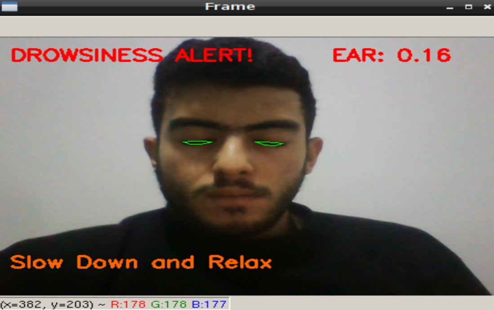

# Drowsiness-Detection
Project of drowsiness detection for raspberry with web server to preview the data that were collected 
Using Python and Flask 
For the raspberry part the code use dlib and openCv to detect faces and to know if the eyes is closed or not and flask help us to create a web server that could receive data collected from raspberry and rpicamera

**Example of RPI result :** 

